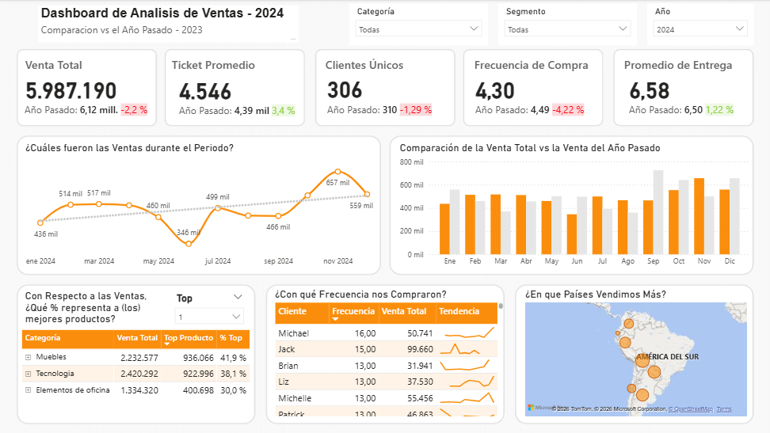
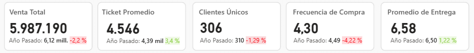

# 
Panel de Comparación de Ventas por Año

## Descripción del Proyecto

Este proyecto presenta un análisis interactivo de ventas con el objetivo de comparar el rendimiento entre distintos períodos (año actual vs año anterior), identificar tendencias clave y detectar oportunidades de mejora en el negocio.

El dashboard permite evaluar métricas clave como ingresos, comportamiento de clientes y desempeño de productos, facilitando la toma de decisiones basada en datos.

---

## Herramientas Utilizadas

* Power BI (visualización y modelado)
* Excel (fuente de datos)
* DAX (medidas y cálculos)

---

## Estructura de los Datos

El modelo de datos está compuesto por 6 tablas relacionadas:

* **Datos (8400 registros):** información transaccional de ventas
* **Productos:** detalle de productos y categorías
* **Clientes:** información de clientes
* **Segmentos:** clasificación de clientes
* **Región:** ubicación geográfica
* **Calendario:** tabla de fechas para análisis temporal

El dataset fue preparado y estructurado para permitir un modelo relacional eficiente, optimizando el análisis en Power BI.

---

## KPIs Principales

* Venta Total
* Ticket Promedio
* Clientes Únicos
* Frecuencia de Compra
* Promedio de Entrega

Cada KPI incluye:

* Comparación con el año anterior
* Variación porcentual (%)

---

## Visualizaciones del Dashboard

### 1. Evolución de Ventas

Análisis temporal de las ventas para identificar tendencias a lo largo del tiempo.

### 2. Comparación Interanual

Comparación directa entre ventas actuales y del año anterior.

### 3. Análisis de Productos

Identificación de los productos más relevantes por categoría y su contribución porcentual a las ventas.

### 4. Comportamiento de Clientes

Evaluación de la frecuencia de compra y valor generado por cliente.

### 5. Análisis Geográfico

Distribución de ventas por región, permitiendo identificar mercados más relevantes.

---

## Análisis Realizado

* Evaluación del crecimiento o caída de ventas interanuales
* Identificación de productos más rentables
* Análisis del comportamiento de compra de clientes
* Detección de regiones con mayor volumen de ventas

---

## Insights Clave

* Las ventas presentan variaciones significativas entre períodos, permitiendo detectar tendencias de crecimiento o desaceleración
* Un grupo reducido de productos concentra una gran parte de los ingresos
* Existen clientes con alta frecuencia de compra que representan un valor estratégico
* Algunas regiones destacan claramente sobre otras en volumen de ventas

---

## Recomendaciones

* Enfocar estrategias comerciales en productos de mayor rendimiento
* Implementar acciones de fidelización para clientes frecuentes
* Analizar regiones con menor desempeño para identificar oportunidades de crecimiento
* Optimizar tiempos de entrega para mejorar la experiencia del cliente

---

## Filtros Interactivos

El dashboard incluye segmentación por:

* Categoría
* Segmento
* Año

---

## Vista del Dashboard

### KPIs principales

---

## Conclusión

Este proyecto demuestra la capacidad de transformar datos en información accionable, utilizando herramientas de análisis y visualización para apoyar la toma de decisiones estratégicas.
